# Microsoft Azure IoT Central Asset Tracking Demo

**NOTE:**
Microsoft has substantially updated the IoT Central UI, including the way of defining device telemetry data and properties. As a result, the below step-by-step instructions and screen shots for creating the Asset Tracking Demo application are no longer valid. We will update the instructions as soon as possible.

In this example, you will create a complete end-to-end Asset Tracking application by combining Electric Imp and Microsoft Azure IoT Central. Your imp-enabled hardware device will report telemetry and location data through the Electric Imp impCloud into IoT Central where data is visualized, you can create business rules, and make changes to device settings in IoT Central that are synced back to the device in real time. imp hardware supported by this example:
* [impC Breakout Board](https://store.electricimp.com/collections/breakout-boards/products/impc001-breakout-board-kit-preorder?variant=7599263973399) plus [Pixhawk GPS](https://www.amazon.com/dp/B01KK9A8QG/ref=cm_sw_r_cp_apip_Cmj3DOu4gUMIv)
* [impExplorer](https://store.electricimp.com/collections/getting-started/products/impexplorer-developer-kit?variant=31118866130)


**NOTE:** The purpose of this example is to show basic concepts and works reliably. The device code is purposely kept simple and is not optimized for power consumption/battery life, minimizing communication volume, or more robust connectivity handling. A real asset tracking device application will be more advanced by entering power save modes based on application state, reducing radio time to minimize power, reduce communication volume (only send data when necessary), and handling different connectivity states (e.g. intermittent connectivity with batching of data, etc).

## Application Details

* Cloud agents connect to the respective IoT Central IoT Hub via MQTT, see [Azure IoT Hub integration](https://github.com/electricimp/AzureIoTHub)
* Register Devices in IoT Central
* Once started, the cloud agent connects to IoT Hub and enables direct sending of data (for telemetry measurements), Device Twins (for device properties and device settings), and Direct Methods (for device restarts)
* Telemetry measurements: The device periodically sends temperature, humidity, and acceleration data (from onboard sensors) to IoT Central. Note that eventhough IoT Hub receives the data almost immediately from the cloud agent it typically takes IoT Central 15 to 20 seconds to update the visualization as the data flows through Azure Time Series Insights, so telemetry data appears sluggish.
* Shock alert: When the accleration exceeds a certain value the device triggers a shock alert and immediately sends the telemetry data
* Device properties: The device sends via Device Twin Properies the location coordinates, device online/offline state, networking information (carrier name or WiFi SSID) and software version which are displayed in the IoT Central "Properties" tab.
* Device settings: Through the IoT Central "Settings" tab the user can make changes to the reporting interval and the LED color -- updated values are sent to the device via desired Device Twin properties
* Direct methods: Through the IoT Central "Commands" tab the user can trigger a "Restart Device" command which results in the device rebooting the VM and restarting the application
* Device location:
  * The impC Breakout Board code will detect and use an attached Pixhawk GPS receiver for location. If the Pixhawk GPS receiver is not connected or has no GPS fix, the code uses (less accurate) cell tower information and the Google Maps/Places API to determine location 
  * The impExplorer code uses a WiFi network scan and the Google Maps/Places API to determine the location

## What You Do

* Configure your impC Breakout Board or impExplorer with BlinkUp&trade;.
* Create an Azure IoT Central application.
* Register your device in IoT Central.
* Run a sample application using the impCentral to send data to Azure IoT Central.

## What You Learn

* How to configure your imp-enabled device with BlinkUp.
* How to use impCentral.
* How to create an Azure IoT Central application.
* How to register your device with Azure IoT Central.
* How to collect data from sensors.
* How to send sensor data to Azure IoT Central.

## What You Need

1. A computer with a web browser.
2. A smartphone with the Electric Imp app ([iOS](https://itunes.apple.com/us/app/electric-imp/id547133856) or [Android](https://play.google.com/store/apps/details?id=com.electricimp.electricimp)).
3. A free [Electric Imp Account](https://impcentral.electricimp.com/login). **NOTE:** If your impC Breakout Board module features an Azure logo then you must create a [Electric Imp Azure Account](https://impcentral-azure.electricimp.com/login).
4. A [Microsoft Account](https://login.microsoftonline.com).
5. Imp Hardware
    * [impExplorer](https://store.electricimp.com/collections/getting-started/products/impexplorer-developer-kit?variant=31118866130)
    * [impC Breakout Board](https://store.electricimp.com/collections/breakout-boards/products/impc001-breakout-board-kit-preorder?variant=7599263973399)
6. If using an impExplorer you will need a 2.4GHz 802.11bgn WiFi network *name* (SSID) and *password*.
7. If using an impC Breakout Board you can add a [Pixhawk GPS](https://www.amazon.com/dp/B01KK9A8QG/ref=cm_sw_r_cp_apip_Cmj3DOu4gUMIv).

**NOTE:** 

If you are using a (non-Azure) Electric Imp account (i.e. your device does **not** have an Azure logo, as in step #3 above) you need to [sign up](https://connect.electricimp.com/azure-mqtt-integration-signup) for our MQTT integration first as your device needs to be assigned to a server with MQTT support. For Electric Imp Microsoft Azure accounts this is already the case, so nothing needs to be done.

## Hardware Setup

### impExplorer

No setup is needed. All sensors are onboard. See the [Dev Center](https://developer.electricimp.com/hardware/resources/reference-designs/explorerkit) for info about the hardware.

### impC Breakout Board

Plug the GPS into the Pixhawk UART connector. All other sensors are onboard. See the [Dev Center](https://developer.electricimp.com/hardware/resources/reference-designs/impc001breakout) for info about the hardware.

### Electric Imp BlinkUp

Open the Electric Imp mobile app on your smartphone to configure your device.

1. Log into your Electric Imp account.
2. Click on **Configure a Device**

### impExplorer

3. Select **Wireless**
4. Enter your 2.4GHz 802.11bgn WiFi credentials, then click **Next**
5. Follow the instructions in the app to configure your device. **NOTE:** Blink up to Amazon AWS (not Microsoft Azure).

### impC Breakout Board

3. Select **Cellular**
4. Follow the instructions in the app to configure your device. **NOTE:** Blink up to Amazon AWS, unless your impC Breakout Board module features the Azure logo - in which case you need to blink up to Microsoft Azure. 

If you have any trouble here are links to the DevCenter's BlinkUp instructions:
* [impExplorer BlinkUp](https://developer.electricimp.com/gettingstarted/explorer/blinkup)
* [impC Breakout Board BlinkUp](https://developer.electricimp.com/gettingstarted/impc001breakoutboard)

### How Electric Imp’s IoT Connectivity Platform Works

The Electric Imp Platform has two main components: the imp-enabled device and the impCloud&trade;. The imp-enabled device runs the device code, which in this use case uses the data gathered from the temperature and humidity sensors as well as the accelerometer on the board. Each device is paired one-to-one with its own online assistant &mdash; or, as we call it, an ‘agent’ &mdash; in the impCloud and which runs the agent code. The device sends this data to its agent. In this example, the agent code relays the data to the Azure IoT Central cloud. Here’s a broad overview of this flow:

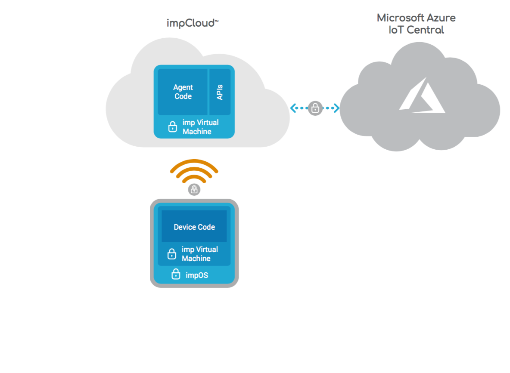

With impCentral Electric Imp provides all the tools you need to write and deploy the software (to the device and to its agent) that will control your imp-enabled connected product. impCental runs in a desktop web browser and communicates between the device and cloud solutions.

### Working With impCentral

1. Open your web browser and log in to the [impCentral](https://impcentral.electricimp.com/login). **NOTE:** If you created your Electric Imp account on Azure, use [impCentral Azure](https://impcentral-azure.electricimp.com/login)
2. Click the **+ Create New Product** button to create a new Electric Imp application.
3. In the pop-up panel, name your **Product** and **Development Device Group** and click **Create**. A code editor will automatically open.
4. Next you will need to assign your device to the Device Group you just created. In the bottom section of the code editor click the **Assign devices** button.
5. In the pop-up panel find your device and click **Assign**.
6. If you have any trouble here is a [link](https://developer.electricimp.com/gettingstarted/explorer/ide) to the DevCenter's impCentral guided tour.
7. Copy and paste the application code from GitHub into the code editor.
    - [Agent Code](./MS_IoTCentral_AssetTracking_Demo.agent.nut) should be placed in the *Agent Code* window to the left in the code editor.
    - [Device Code](./MS_IoTCentral_AssetTracking_Demo.device.nut) should be placed in the *Device Code* window to the right in the code editor.

## Azure IoT Central Set Up

### Create an IoT Central Application

1. Login to [Microsoft IoT Central](https://apps.azureiotcentral.com/):

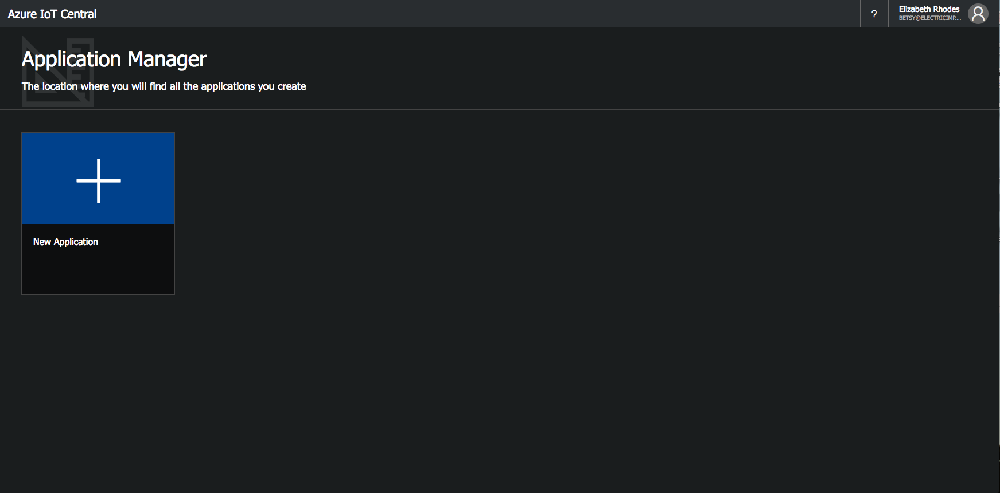

2. In the pop-up panel select:

 - Choose payment plan: **Trial**.

 - Select an application template: **Custom Application**.

 - Enter an Application Name: **YOUR APPLICATION NAME**. For this example I'll use the name: *EI Asset Tracking Monitor*. **Note:** The URL field will auto poplutate to match the Application name.

 - Click **Create** button. You will be redirected to your Applicaation's home page.

 **NOTE:** If you wish to create a pay-as-you-go appliction, follow Microsoft's directions to setup a subscription plan.

### Create an IoT Central Device Template

1. On the Homepage Click on the **Create Device Templates** shortcut to create a device template. This will also create your first device of this type:

 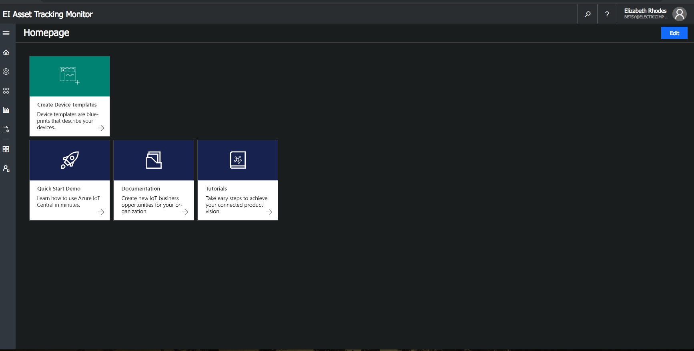

2. Enter the name for your device template. For this example I'll use the name *impTracker*, since my devices will be Electric Imp powered asset trackers:

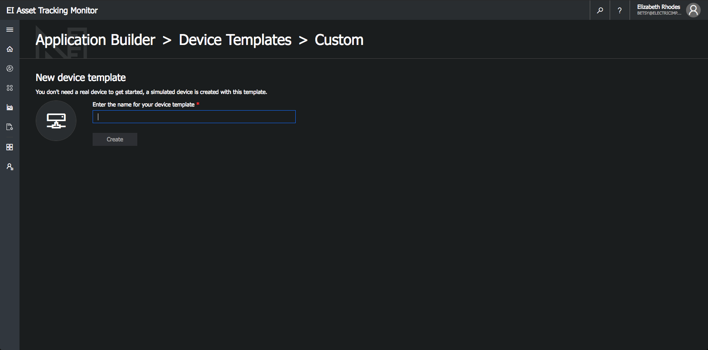

3. After creating a device template your first simulated device will be automatically created. You will automatically be redirected to the Device Details page for your your simulated device. You can edit the device name and upload a photo if desired.

#### Create Device Template Measurements

The Device Detail page will default to the **Measurements** tab. To configure the measurements we need to match the data that the imp is sending via the application code with our device template. For this application our measurements will include telemetry, state and event data. Our telemetry data will include *temperature*, *humidity*, and *acceleration*. We will track device online/offline state, and we will configure one event, *accelerationAlert*. Follow the steps below to configure the device template measurements.

1. Add **temperature** to the device template:
 - Click **+ New Measurement**
 - Select **Telemetry**.

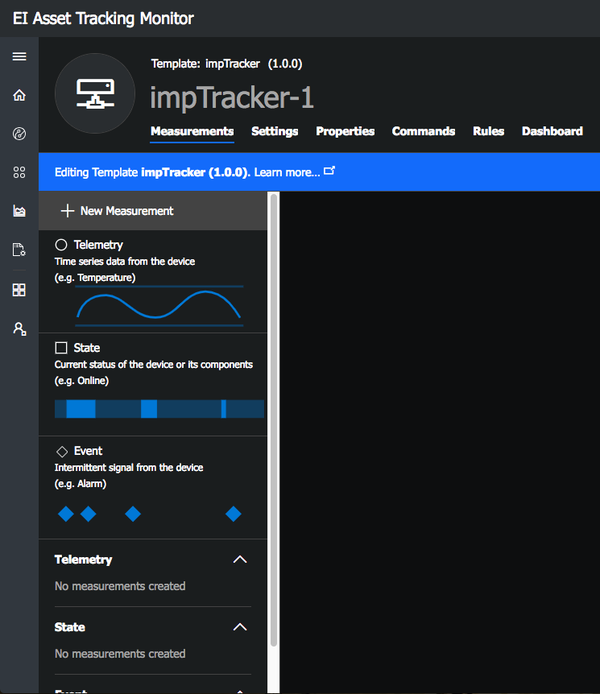

 - Fill in Telemetry form:

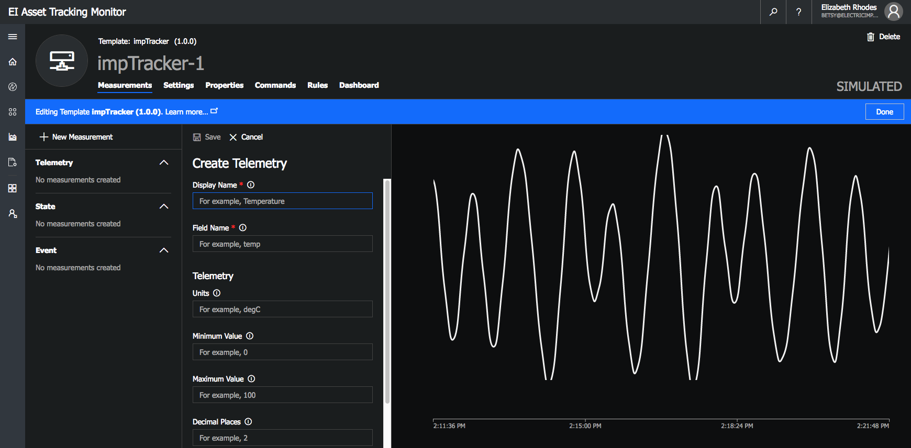

 - Fill in the **Display Name**, this will be displayed in your application.
 - Fill in **Field Name**, this must match the code from your agent/device, so for this example this field must be *temperature*.
 - (Optional) fill in **Units**, for this example *degC*.
 - (Optional) **Minimum Value**, graphing will use this value to set the y axis, so choose a value that makes sense for your application. I have used a value of *20*.
 - (Optional) **Maximum Value**, graphing will use this value to set the y axis, so choose a value that makes sense for your application. I have used a value of *35*.
 - (Optional) **Decimal Places**, enter the number of decimal places your data should display. I have used a value of *1*.
 - At the top of the form click **Save**.

2. Add **humidity** to the device template:
 - Click **+ New Measurement**
 - Select **Telemetry**.
 - Fill in Telemetry form:
    - Fill in the **Display Name**, this will be displayed in your application.
    - Fill in **Field Name**, this must match the code from your agent/device, so for this example this field must be *humidity*.
    - (Optional) fill in **Units**, for this example *%*.
    - (Optional) **Minimum Value**, graphing will use this value to set the y axis, so choose a value that makes sense for your application. I have used a value of *0*.
    - (Optional) **Maximum Value**, graphing will use this value to set the y axis, so choose a value that makes sense for your application. I have used a value of *100*.
    - (Optional) **Decimal Places**, enter the number of decimal places your data should display. I have used a value of *1*.
    - At the top of the form click **Save**.

3. Add **acceleration** to the device template:
 - Click **+ New Measurement**
 - Select **Telemetry**.
 - Fill in Telemetry form:
    - Fill in the **Display Name**, this will be displayed in your application.
    - Fill in **Field Name**, this must match the code from your agent/device, so for this example this field must be *acceleration*.
    - (Optional) fill in **Units**, for this example *g*.
    - (Optional) **Minimum Value**, graphing will use this value to set the y axis, so choose a value that makes sense for your application. I have used a value of *0.8*.
    - (Optional) **Maximum Value**, graphing will use this value to set the y axis, so choose a value that makes sense for your application. I have used a value of *1.5*.
    - (Optional) **Decimal Places**, enter the number of decimal places your data should display. I have used a value of *1*.
    - At the top of the form click **Save**.

4. Add **Device State** to the device template:
 - Click **+ New Measurement**
 - Select **State**.
 - Fill in Create State form:
    - Fill in the **Display Name**, this will be displayed in your application, I have used *Device Online*.
    - Fill in **Field Name**, I have used *online*.
    - Add *New Value*
        - Fill in **Value**, this should be *true*.
        - Fill in **Display Name**, I have used *Online*
        - Select a color
    - Add *New Value*
        - Fill in **Value**, this should be *false*.
        - Fill in **Display Name**, I have used *Offline*
        - Select a different color
    - At the top of the form click **Save**.

5. Add **Event** to the device template:
 - Click **+ New Measurement**
 - Select **Event**.
 - Fill in Create Event form:
    - Fill in the **Display Name**, this will be displayed in your application, I have used *AccelAlert*.
    - Fill in **Field Name**, this must match the code from your agent/device, so for this example this field must be *acclerationAlert*.
    - Select *Default Severity*, I have set this to *Warning*
    - At the top of the form click **Save**.

#### Create Device Template Settings

In the settings we can configure the messages to be sent to the device. For this application we can configure how often the device reports telemetry data and the color of the LED.

* Click on the **Settings** tab just under the device name.
* Click on Edit Template


* In the **Library** sidebar select the following to bring up the settings forms.

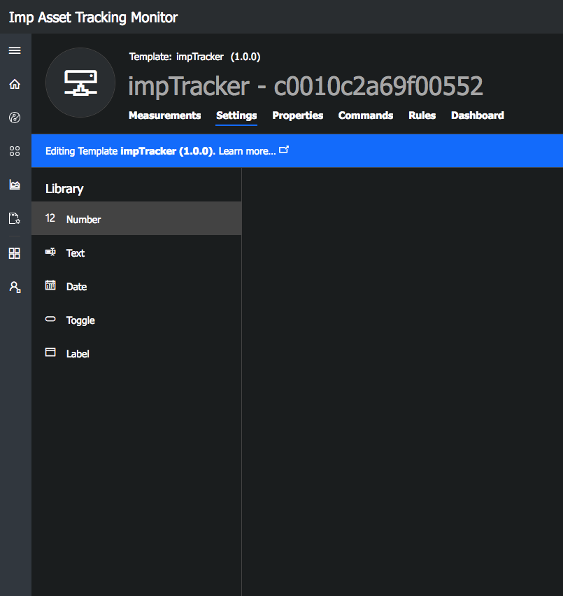

1. Add **reportingInterval** setting to the device template:
    - Click **Number**
    - Fill in Configure Number form:
        - Fill in the **Display Name**, this will be displayed in your application. I have used *Reporting Interval*
        - Fill in **Field Name**,  this must match the code from your agent/device, so for this example this field must be *reportingInterval*.
        - Fill in **Unit of Measurement**, the application code requires this setting to be seconds, *sec*.
        - Fill in **Number of Decimal Places**, the application expects this to be an intger, so set this to *0*.
        - Fill in **Minimum Value**, this must be a positive integer, so set this to *0*.
        - Fill in **Maximum Value**, you should select a value that makes sense for your application, since we are not conserving battery life let's limit this to *100*.
        - Fill in **Initial Value**, for testing let's set this to something pretty low so we can see data coming in, *10*.
        - Fill in **Description**, I have used *Set reporting interval*.
    - At the top of the form click **Save**.

2. Add **LED Color** setting to the device template:
    - Click **Text**
    - Fill in Configure Text form:
        - Fill in the **Display Name**, this will be displayed in your application. I have used *LED Color*
        - Fill in **Field Name**,  this must match the code from your agent/device, so for this example this field must be *ledColor*.
        - Fill in **Trim Leading Spaces**, set this toggle to *On*.
        - Fill in **Trim Trailing Spaces**, set this toggle to *On*.
        - Fill in **Case Sensitivity In Comparison**, set this toggle to *On*.
        - Fill in **Case Sensitivity In Data Entry**, select *upper*.
        - Fill in **Minimum Length**, this must be a positive integer, so set this to *0*.
        - Fill in **Maximum Length**, the application only has 3 colors it will accept (RED, YELLOW, and GREEN), so it is safe to set this to *10*.
        - Fill in **Initial Value**, the application only has 3 colors it will accept (RED, YELLOW, and GREEN), I have selecet *YELLOW* for the default.
        - Fill in **Description**, I have used *Set LED Color*.
    - At the top of the form click **Save**.

#### Create Device Template Properties

* Click on the **Properties** tab just under the device name.
* Click on Edit Template
* In the **Library** sidebar select the following to bring up the settings forms.

1. Add **Device Online** setting to the device template:
    - Click **Device Property**
    - Fill in Configure Device Property form:
        - Fill in the **Display Name**, this will be displayed in your application. I have used *Device Online*
        - Fill in **Field Name**,  this must match the code from your agent/device, so for this example this field must be *online*.
        - Fill in **Data Type**, select *text*.
        - Fill in **Description**, I have used *Device Online*.
    - At the top of the form click **Save**.

2. Add **Network Info** setting to the device template:
    - Click **Device Property**
    - Fill in Configure Device Property form:
        - Fill in the **Display Name**, this will be displayed in your application. I have used *Network Info*
        - Fill in **Field Name**,  this must match the code from your agent/device, so for this example this field must be *network*.
        - Fill in **Data Type**, select *text*.
        - Fill in **Description**, I have used *Network Info*.
    - At the top of the form click **Save**.

3. Add **Device Software Version** setting to the device template:
    - Click **Device Property**
    - Fill in Configure Device Property form:
        - Fill in the **Display Name**, this will be displayed in your application. I have used *Device Software Version*
        - Fill in **Field Name**,  this must match the code from your agent/device, so for this example this field must be *softwareVersion*.
        - Fill in **Data Type**, select *text*.
        - Fill in **Description**, I have used *Device Software Version*.
    - At the top of the form click **Save**.

4. Add **Device Location** setting to the device template:
    - Click **Device Property**
    - Fill in Configure Device Property form:
        - Fill in the **Display Name**, this will be displayed in your application. I have used *Device Location*
        - Fill in **Field Name**,  this must match the code from your agent/device, so for this example this field must be *location*.
        - Fill in **Data Type**, select *location*.
        - Fill in **Description**, I have used *Device Location*.
    - At the top of the form click **Save**.

#### Create Device Template Commands

* Click on the **Commands** tab just under the device name.
* Click on Edit Template

1. Click **+ New Commnad***
    - Fill in Configure Command form:
        - Fill in the **Display Name**, this will be displayed in your application. I have used *Restart Device*
        - Fill in **Field Name**,  this must match the code from your agent/device, so for this example this field must be *restart*.
        - Fill in **Default Timeout**, leave the default *30*.
        - Fill in **Data Type**, select *text*.
        - Fill in **Description**, I have used *Restart Device*.
    - At the top of the form click **Save**.

### Registering Your Device with Azure IoT Central

**Note:** We will soon be able to register devices programatically, but until then please follow the steps below to register your device manually.

To register a device we will need to generate a device connection string and copy and paste it into the agent code. For more information see [Getting a Device Connection String](https://docs.microsoft.com/en-us/azure/iot-central/concepts-connectivity#getting-device-connection-string). We will need the following id's and keys: *Scope ID*, *Device ID*, and the *Primary Device SAS Key*, and a command line npm key generation tool to generate a device connection string.

#### Scope Id

The *Scope Id* can found on Microsoft's IoT Central's Application Adminiastation page.

* **Click** the *Admin* icon in the sidebar
* **Click** on the *Device Connection* tab in the Application Settings sidebar

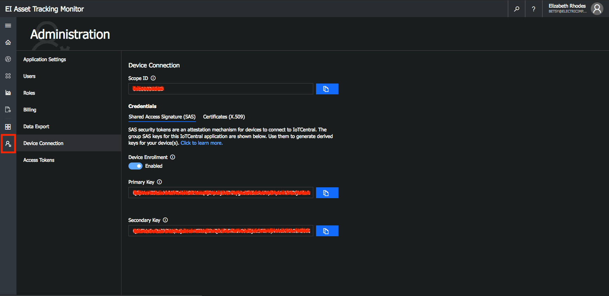

#### Device Id

Your *Device Id* can be found in Electric Imp's impCentral ide. You will need this to create both the *Primary Device SAS Key* and the *Device Connection String*

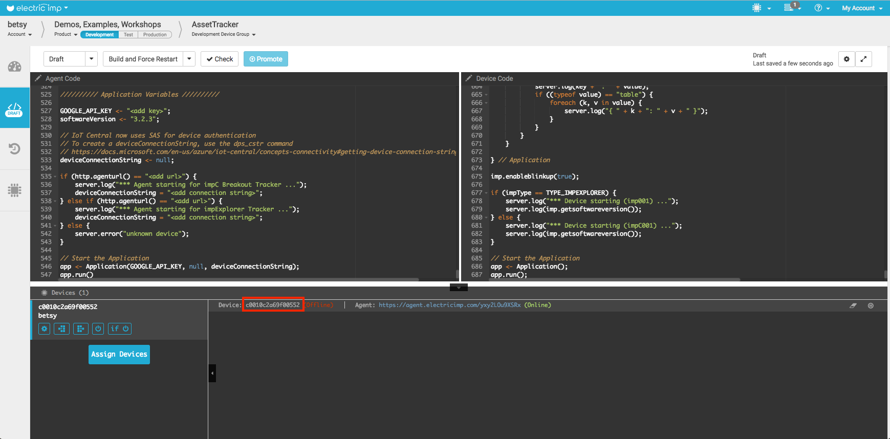

#### Primary Device SAS Key

To get a device SAS Key we will need to create a new *Real* device. Navigate to the *Explorer* tab.

* **Click** the *Explorer* icon in the sidebar
* **Click** *+ New* and select *Real*

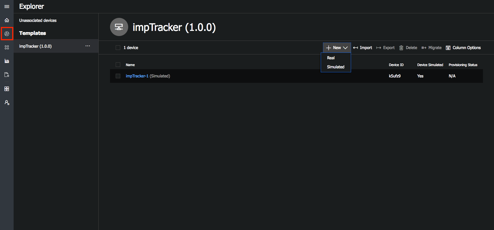

A from will pop up.

* Copy and paste the *Device Id* from the impCentral IDE into the Device ID field.
* **Click** *Create*

You will be redirected to that device's details page.

* **Click** *Connect*


A pop-up will appear. Double check that the *Scope Id* and *Device Id* match the previous steps. Take note of the *Primary Key* - this is the *Primary Device SAS Key*.

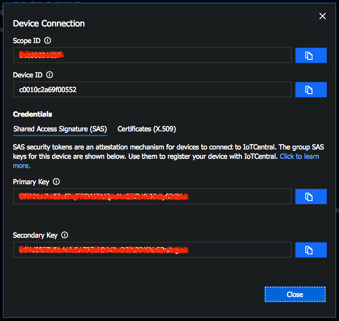

#### Generate Device Connection String

We will now use the command line and npm to download a key generation tool and binary file. The binary file can be found in Github in the following [repo](https://github.com/Azure/dps-keygen/tree/master/bin). Select the folder for your OS and download the **dps_cstr** file.

Open your command line navigate to where the **dps_cstr** file was downloaded. Make sure the **dps_cstr** file is an executable. This can be checked with the following cmd:

`ls -la`

Find the line that contains the info for **dps_cstr**. It should look something like the following:

`-rwxr-xr-x@  1 electricimp  staff   649K Nov 12 13:05 dps_cstr`

If it is not run the following cmd:

`sudo chmod -x dps_cstr`

Once you are sure the **dps_cstr** file is configured correctly, run the following command to install the dps key generation package:

`npm i -g dps-keygen`

Next run this command with the key from the previous steps:

`./dps_cstr <scopeID> <deviceID> <primaryDeviceSASkey>`

The output should look something like this:
```
...
Registration Information received from service: saas-iothub-<YOUR APPLICATION IOTHUB ID HERE>.azure-devices.net!
Connection String:
HostName=saas-iothub-<YOUR APPLICATION IOTHUB ID HERE>.azure-devices.net;DeviceId=<YOUR DEVICE ID>;SharedAccessKey=<YOUR PRIMARY DEVICE SAS KEY>
```

#### Connect your Imp to IoT Central

Open the impCentral code editor and paste the **Connection string** into the agent code **deviceConnectionString** variable found near the end of the agent code.


Click **Build and Force Restart** to start running your application.

IoT Central will take about 10-15 seconds to start updating the telemetry data plot, at which point you will see the telemetry data coming from the Fieldbus Gateway.

### Location for WiFi Imps

If you want location data from a Wifi Imp (ie the impExplorer) you will need to add a Google API key to the agent code. You can apply for an API key on the [Google Developer Console](https://console.developers.google.com/apis/credentials). Once you have obtained an API key enter it into the *GOOGLE_API_KEY* constant and click **Build and Force Restart** update your application.

### Next Steps

Now that your device is configured and connected you can explore how to use IoT central feature to visualize your data. You can configure dashboards and shortcuts to your application home page. Here is an example dashboard:


Also try out the other device tabs:
* Measurements: View telemetry data
* Settings: View and change device settings and sync them back to the device
* Properties: View device and application properties
* Commands: Execute device restart command
* Rules: Create business rules and orchestrations
